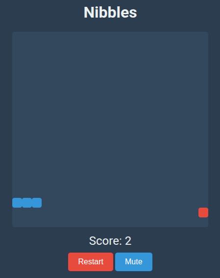

# Nibbles

A simple snake game built with TypeScript and HTML5 Canvas.

## Screenshot

## How to play

Use the arrow keys to control the snake. Eat the food to grow and increase your score. The game is over if you hit the walls or yourself.

## How to run

1. Clone the repository.
2. Run `npm install`.
3. Run `npm run dev`.

---

This little project was made with vibe coding and Gemini CLI.
